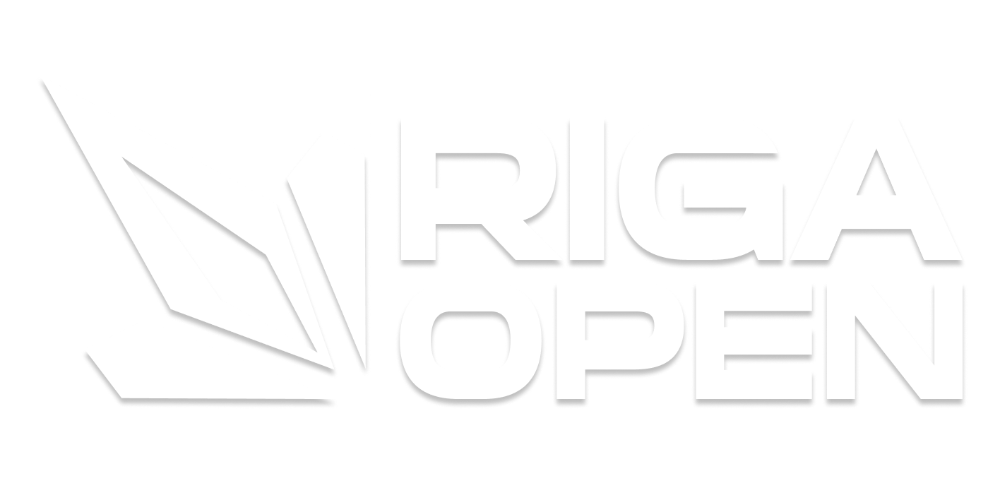

  

**Official Rulebook** 

Urban Riga Open

\#4

**Dear reader,**

Welcome to the Urban Riga Open \#4\! We’re excited to have you on board. To ensure a smooth and enjoyable experience for everyone, we ask you to follow these essential rules. Adhering to these guidelines helps avoid any penalties and keeps the competition fair and fun for all.

Remember, the tournament administration has the final say on all matters. Sometimes, decisions may be made beyond what’s stated in this rulebook to uphold the spirit of fair play and good sportsmanship.

“Urban Riga Open \#4” tournament is organized by Potion Agency SIA (40203488582).

“Urban Riga Open \#4”  is a Tier 2 Valve Regional Standings (VRS) Ranked Counter-Strike 2 tournament with an open LAN format. This event provides a grassroots competitive experience in the heart of Riga, welcoming any team ready to compete. 

As a VRS-ranked event, Urban Riga Open \#4 adheres to Valve’s rules for ranked tournaments, ensuring a fair structure for invites and qualifiers. The Valve Regional Standings (VRS) is the official ranking system used by Valve to gauge team performance and determine invitations for CS2 events. This rulebook outlines all regulations, format details, and expectations for teams participating in Urban Riga Open \#4.

Finally, our goal is to create an engaging and exciting event for participants, spectators, and partners.

Best regards,

Riga Open staff.

[**SECTION ONE \- General information	5**](#section-one---general-information)

[1.1. Event name	5](#1.1.-event-name)

[1.2. Tier	5](#1.2.-tier)

[1.3. Dates	5](#1.3.-dates)

[1.4. Location	5](#1.4.-location)

[1.5. Team Cap	5](#1.5.-team-cap)

[1.6. Registration	5](#1.6.-registration)

[1.7. Prize pool	6](#1.7.-prize-pool)

[1.8. Team Eligibility	6](#1.8.-team-eligibility)

[1.9. Sign-up Process	6](#1.9.-sign-up-process)

[1.10. VRS Seeding	6](#1.10.-vrs-seeding)

[1.11. Matchtimes	7](#1.11.-matchtimes)

[1.12. Check-in	8](#1.12.-check-in)

[1.13. Operator	8](#1.13.-operator)

[1.14. Rule changes	8](#1.14.-rule-changes)

[1.15. Collection of personal data	8](#1.15.-collection-of-personal-data)

[1.16. The game	8](#1.16.-the-game)

[1.17. Servers	8](#1.17.-servers)

[1.18. Tournament schedule	9](#1.18.-tournament-schedule)

[1.19. Contact persons	9](#1.19.-contact-persons)

[1.20. Broadcast rights	9](#1.20.-broadcast-rights)

[1.21. Entry fee	9](#1.21.-entry-fee)

[1.21. Refund policy	9](#1.21.-refund-policy)

[**2\. SECTION TWO \- Player rules	10**](#2.-section-two---player-rules)

[2.1. Player age	10](#2.1.-player-age)

[2.2. Parental consent	10](#2.2.-parental-consent)

[2.3. Player nickname	10](#2.3.-player-nickname)

[2.4. Entering Latvia	10](#2.4.-entering-latvia)

[**3\. SECTION THREE \- Teams rules	11**](#3.-section-three---teams-rules)

[3.1. Team region	11](#3.1.-team-region)

[3.2. Team size	11](#3.2.-team-size)

[3.3. Team name	11](#3.3.-team-name)

[3.4. Team captain	11](#3.4.-team-captain)

[3.5. Contact person	11](#3.5.-contact-person)

[3.6. Emergency player change	11](#3.6.-emergency-player-change)

[**4\. SECTION FOUR \- Game rules	12**](#4.-section-four---game-rules)

[4.1. Game version	12](#4.1.-game-version)

[4.2. Map pool	12](#4.2.-map-pool)

[4.3. Change of map pool	12](#4.3.-change-of-map-pool)

[4.4. Match settings	12](#4.4.-match-settings)

[4.5. Group Stage	13](#4.5.-group-stage)

[4.5.3. Group stage format for 12 teams example	13](#4.5.3.-group-stage-format-for-12-teams-example)

[4.5.4. Group stage format for 24 teams example	13](#4.5.4.-group-stage-format-for-24-teams-example)

[4.6. Playoffs	14](#4.6.-playoffs)

[4.6.1. In case of 12 Teams	14](#4.6.1.-in-case-of-12-teams)

[4.6.2. In case of 24 Teams	14](#4.6.2.-in-case-of-24-teams)

[4.7. Tactical pause	14](#4.7.-tactical-pause)

[4.8. Technical pause	14](#4.8.-technical-pause)

[4.9. Agent skins	14](#4.9.-agent-skins)

[4.10. Higher seed	15](#4.10.-higher-seed)

[4.11. BO1 veto	15](#4.11.-bo1-veto)

[4.12. BO3 veto	16](#4.12.-bo3-veto)

[4.13. Veto time	16](#4.13.-veto-time)

[4.14. Coaches	16](#4.14.-coaches)

[4.15. Match rescheduling	16](#4.15.-match-rescheduling)

[4.16. LAN additional rules	17](#4.16.-lan-additional-rules)

[4.16.1. Travel and accomodation	17](#4.16.1.-travel-and-accomodation)

[4.16.2. Equipment onsite	17](#4.16.2.-equipment-onsite)

[4.16.3. Players’ equipment	17](#4.16.3.-players’-equipment)

[4.16.4. Compliance with Valve Requirements	17](#4.16.4.-compliance-with-valve-requirements)

[4.17. Playoffs seeding	18](#4.17.-playoffs-seeding)

[4.17.1. 6 team playoff (12 teams participants in total)	18](#4.17.1.-6-team-playoff-\(12-teams-participants-in-total\))

[4.17.2. 12 team playoff (24 teams participants in total)	18](#4.17.2.-12-team-playoff-\(24-teams-participants-in-total\))

[4.18. Media Obligations	18](#4.18.-media-obligations)

[**5\. SECTION FIVE \- Prize pool	19**](#5.-section-five---prize-pool)

[5.1. Prize distribution	19](#5.1.-prize-distribution)

[5.2. Prize payout	19](#5.2.-prize-payout)

[**6\. SECTION SIX \- Integrity and conduct	20**](#6.-section-six---integrity-and-conduct)

[6.1. Cheating	20](#6.1.-cheating)

[6.2. Betting	20](#6.2.-betting)

[6.3. Use of third-party information	20](#6.3.-use-of-third-party-information)

[6.4. Match-fixing	20](#6.4.-match-fixing)

[6.5. Bugs, glitches	20](#6.5.-bugs,-glitches)

[6.6. Penalties	20](#6.6.-penalties)

[**7\. APPENDIX I \- Tournament schedule	21**](#7.-appendix-i---tournament-schedule)

# **SECTION ONE \- General information** {#section-one---general-information}

## **1.1. Event name** {#1.1.-event-name}

Urban Riga Open \#4

## **1.2. Tier**  {#1.2.-tier}

Tier 2 VRS-ranked event.

## **1.3. Dates** {#1.3.-dates}

* If 24 teams: January 4th \- January 6th, 2025 (Three days, Sunday, Monday & Tuesday)  
* If 12 teams \- January 4th \- January 5th, 2025 (Two days, Sunday & Monday) 

## **1.4. Location** {#1.4.-location}

Cyber Empire esports club \- Dzelzavas iela 21A, Vidzemes priekšpilsēta, Rīga, Latvia,   
LV-1084

## **1.5. Team Cap** {#1.5.-team-cap}

Maximum of 24 teams. Minimum of 12 teams. Registration is open to any team (first-come, first-served). Each team consists of 5 players, with the option to have 1 coach. All participants must be able to attend on-site.

## **1.6. Registration** {#1.6.-registration}

Teams must register via Google Form. A registration fee of €950 (+VAT) per team (covers 5 players \+ 1 coach). It will be sent as an invoice and is required to be paid in 72 hours to confirm entry (3 business days). Registration is first-come, first-served; once 24 teams register, sign-ups will close.

## **1.7. Prize pool** {#1.7.-prize-pool}

The prize pool is crowdfunded by team entries. It scales with the number of teams:

- 12 teams  
  - 1st place \- 3500$  
  - 2nd place \- 2000$   
  - 3rd \- 1000$

- 24 teams  
  - 1st place \- 6000$  
  - 2nd place \- 4000$  
  - 3rd \- 1000$

## **1.8. Team Eligibility**  {#1.8.-team-eligibility}

Open to all teams in the Global region, as defined by Valve’s official rules and regulations. No prior qualification or minimum rank is required; however, all players must have valid CS2 accounts in good standing (no VAC bans in the last 2 years). 

## **1.9. Sign-up Process**  {#1.9.-sign-up-process}

Teams register via Google Form. Once thats filled, organizer will contact the team with and request teams requisite and send an invoice. Once thats paid (payment of the €950 (+VAT), team fee secures the spot. 

## **1.10. VRS Seeding** {#1.10.-vrs-seeding}

In line with Valve’s guidelines for Tier 2 events, Urban Riga Open \#4 will use VRS rankings to seed teams into Groups. 

Seeding will be based on the official Global VRS ranking released on Monday, 1st of December 2025\.

The seeding for the “Urban Riga Open \#4” Main Tournament will be determined using a hierarchical ranking system to ensure a competitive and fair placement of teams. The seeding methodology is as follows (24-team event example):

1. **Primary Seeding:** Global VRS ranking (as of December 1st, 2025\)

2. **Secondary Seeding:** If no Global VRS ranking → HLTV ranking (December 1st, 2025\)

3. **Tertiary Seeding:** If no HLTV ranking → average FACEIT Elo of the full team (as of December 1st, 2025\)

The final seeding list will be compiled on Monday, December 1st, 2025, incorporating all eligible teams according to the hierarchy above.

Tournament administration reserves the right to make final decisions on all seeding matters to ensure the integrity of the competition.

1.10.1. Reseeding

If any dropouts occur more than 15 days before the event's start date, the tournament will be reseeded. If the dropout happens within 15 days of the tournament’s start, the replacement team will inherit the dropped team’s position in the tournament. However, they will be assigned the lowest available seed in that stage for the purposes of the map veto. All teams seeded below the dropped team will move up one spot in the seeding for the map veto.

## **1.11. Matchtimes** {#1.11.-matchtimes}

See schedule [**here**](https://docs.google.com/spreadsheets/d/1Zjj2pPhesYR9q8XDEJu5nSzaEgwRJpOY6VFFwMw6K0k/edit?usp=sharing). 

## **1.12. Check-in** {#1.12.-check-in}

Teams must check in at the venue 1 hour before their scheduled game (exact schedule to be provided by admins via  Discord, Email or WhatsApp once all teams are known). All team members should be on-site and ready at least one hour before their first match. Any team that fails to check in on time may be disqualified.

## **1.13. Operator** {#1.13.-operator}

The operator of the “Urban Riga Open \#4” tournament is “Potion Agency SIA” (40203488582).

## **1.14. Rule changes** {#1.14.-rule-changes}

The operator reserves the right to change the rules without prior warning. In a case that is not covered by the written rules, the operator reserves the right to take measures to preserve the integrity and fair-play spirit of the competition.

## **1.15. Collection of personal data** {#1.15.-collection-of-personal-data}

The administrator of personal data collected for the purposes of the tournament (i.e., data provided by participants for the purpose of participating in the tournament) is the operator. Participants can request to validate, edit or delete their data. To make such a request please contact us at urbancontenders@hotmail.com with an email title "personal data request”. Failure to provide or provision of false data may result in inability to participate in the tournament.

## **1.16. The game** {#1.16.-the-game}

The game played in the tournament is Counter Strike 2 published by Valve Corporation.

## **1.17. Servers** {#1.17.-servers}

Local servers will be provided by the Urban Riga Open \#4, however FACEIT (or DatHost) servers in Stockholm/Helsinki might be used as backup.

## **1.18. Tournament schedule** {#1.18.-tournament-schedule}

The schedule of the tournament is specified in Appendix 1 to the rulebook.

## **1.19. Contact persons** {#1.19.-contact-persons}

| Name | *Sandis Rainskis* |
| :---- | ----: |
| **Role** | *Main tournament organizer* |
| **Email** | *rainskis.sandis@gmail.com* |
| **Discord** | *.sandis* |

## **1.20. Broadcast rights** {#1.20.-broadcast-rights}

GOTV relays will be shared on the organizer’s Discord server per request.

## **1.21. Entry fee** {#1.21.-entry-fee}

To participate in the open qualifier, a team must complete the registration form available in Urban Contenders socials and pay the required entry-fee of 950 EUR (+VAT depending on the country).

## **1.21. Refund policy** {#1.21.-refund-policy}

The participation fee is non-refundable, except in the case that the tournament is cancelled due to insufficient teams (fewer than 12 registered and paid teams).

If the event is cancelled under these circumstances, all paid participation fees will be fully refunded to the respective teams.

No refunds will be issued for withdrawals, no-shows, or inability to participate for reasons not caused by the tournament operator.

# **2\. SECTION TWO \- Player rules** {#2.-section-two---player-rules}

## **2.1. Player age** {#2.1.-player-age}

A participant in the games can be a person who is at least 14 years old on the day the tournament begins.

## **2.2. Parental consent** {#2.2.-parental-consent}

If the participant is a minor (\<18 years old), they must have parental consent to participate in the tournament.

## **2.3. Player nickname** {#2.3.-player-nickname}

Each player must choose his own nickname, which he uses during the games. This name cannot be changed without the permission of the operator.

## **2.4. Entering Latvia** {#2.4.-entering-latvia}

Each player must be able to enter the Schengen territory and Latvia (with ID in case of EU residents, passport and visa if necessary in other cases).

The operator may require players to provide proof of their eligibility to enter the territory of Latvia.

Inability to enter Latvia due to visa or other restrictions may result in disqualification from any stage of the tournament.

# **3\. SECTION THREE \- Teams rules** {#3.-section-three---teams-rules}

## **3.1. Team region** {#3.1.-team-region}

The tournament will use Global VRS ranking, thus it does not restrict the team’s region.

## **3.2. Team size** {#3.2.-team-size}

A team may consist of 5 core players, 1 reserve player and 1 coach. The coach can be both a coach and a reserve player.

## **3.3. Team name** {#3.3.-team-name}

Each team must have its own name, which must be provided while registering for the tournament. This name cannot be changed without the permission of the operator.

## **3.4. Team captain** {#3.4.-team-captain}

Each team must have its captain, who must be indicated during team registration.

## **3.5. Contact person** {#3.5.-contact-person}

The captain of each team designates a contact person for the operator, administrators and other teams.

## **3.6. Emergency player change** {#3.6.-emergency-player-change}

In the event of an emergency or if a team is unable to field a full squad due to unforeseen circumstances, the operator may allow an emergency substitution. However, such a change must be supported by valid and appropriate justification. A player completing the lineup cannot be a member of any team participating in the competition. Decisions on allowing an emergency change are made by the operator on a case-by-case basis.

# **4\. SECTION FOUR \- Game rules** {#4.-section-four---game-rules}

## **4.1. Game version** {#4.1.-game-version}

The latest available version of the game will be used during the tournament. In the event that the latest version is considered unplayable, the tournament administration may decide to play the tournament on the latest playable version of the client (if technically possible).

## **4.2. Map pool** {#4.2.-map-pool}

Map pool is conducted using the Active Duty Map pool. Currently, the map-pool consists of seven (7) maps:

* de\_inferno  
* de\_mirage  
* de\_nuke  
* de\_dust2  
* de\_overpass  
* de\_anubis  
* de\_ancient

## **4.3. Change of map pool** {#4.3.-change-of-map-pool}

The map pool will follow the official Active Duty Map pool as defined by Valve, and therefore might be updated before each tournament phase.

## **4.4. Match settings** {#4.4.-match-settings}

* Rounds: Best out of 24 (mp\_maxrounds 24\)  
* Round time: 1 minute 55 seconds (mp\_roundtime 1.92)  
* Start money: $800 (mp\_startmoney 800\)  
* Buy time: 20 seconds (mp\_buytime 20\)  
* Freeze time: 20 seconds (mp\_freezetime 20\)  
* Bomb timer: 40 seconds (mp\_c4timer 40\)  
* Overtime rounds: Best out of 6 (mp\_overtime\_maxrounds 6\)  
* Overtime start money: $10,000 (mp\_overtime\_startmoney 10000\)  
* Round restart delay: 5 seconds (mp\_round\_restart\_delay 5\)  
* Break during half time in overtimes: disabled

## **4.5. Group Stage** {#4.5.-group-stage}

	4.5.1. Group Scoring system  
Teams are awarded with points after the match:

* 3 points – Win in regulation time   
* 2 points – Win in overtime   
* 1 point – Loss in overtime   
* 0 points – Loss in regulation time

4.5.2. Group Scoring system  
If two or more teams are tied in total points at the end of the group stage, the following criteria will be applied in order:

* Head-to-head result  
* Round difference  
* Fewer total round losses   
* Higher initial seed

### 4.5.3. Group stage format for 12 teams example {#4.5.3.-group-stage-format-for-12-teams-example}

Two round-robin format groups Each group has 6 teams All matches are Bo1. Top three teams from each group advance to the Playoffs: 

* Group stage winners proceed to the Semi-Finals  
* Group stage runners-up proceed to the Quarterfinals as the High Seeds   
* Group stage 3rd place teams proceed to the Quarterfinals as the Low Seeds

### 4.5.4. Group stage format for 24 teams example {#4.5.4.-group-stage-format-for-24-teams-example}

Four round-robin format groups Each group has 6 teams All matches are Bo1. Top three teams from each group advance to the Playoffs: 

* Group stage winners proceed to the Quarterfinals   
* Group stage runners-up proceed to the Round of 12 as the High Seeds   
* Group stage 3rd place teams proceed to the Round of 12 as the Low Seeds

## **4.6. Playoffs** {#4.6.-playoffs}

### 4.6.1. In case of 12 Teams {#4.6.1.-in-case-of-12-teams}

6 teams in total in playoffs (3 from each group). Single elimination bracket where all matches are Bo3;

### 4.6.2. In case of 24 Teams {#4.6.2.-in-case-of-24-teams}

12 teams in total in playoffs (3 from each group). In scenario if 24 teams may attend the tournament single-elimination playoffs will start with Round of 12 (pre-quarterfinals) in Bo1 format;

All matches onwards are played Bo3;

## **4.7. Tactical pause** {#4.7.-tactical-pause}

A team can use the pause option in the game menu (ESC \-\> Call Vote \-\> Call Tactical Timeout) to order a tactical pause. During regulation game time, each team has 3 tactical pauses, each lasting 30 seconds. During overtime, each team has only 1 tactical pause of 30 seconds each for each overtime period.

## **4.8. Technical pause** {#4.8.-technical-pause}

In the event of a technical problem preventing the match from being played, a team may use the “.tech” command to pause the game. The pause will start during the next freezetime. It is the team's responsibility to immediately inform the administrator of the reason for using a technical pause.

## **4.9. Agent skins** {#4.9.-agent-skins}

Agent skins are not allowed.

## **4.10. Higher seed** {#4.10.-higher-seed}

A team’s seeding during map veto is determined in the following order of priority:

* **VRS ranking –** the latest global team ranking published by Valve Corporation.  
* **HLTV ranking –** the latest global team ranking published by HLTV.org, used only if the VRS ranking is unavailable.  
* **FACEIT ELO –** the average ELO rating of the team's core players on FACEIT, used only if both VRS and HLTV rankings are unavailable. 

A team with the VRS ranking will always be seeded higher than a team whose seeding is based on either the HLTV ranking or FACEIT ELO. Likewise, a team with the HLTV ranking will always be seeded higher than a team whose seeding is based only on FACEIT ELO.

## **4.11. BO1 veto** {#4.11.-bo1-veto}

Map selection is determined by the ban method for Best of 1 (BO1) matches and the Ban and Pick method for Best of 3 (BO3) matches. The team with the highest seed decides who initiates the ban process. Example of BO1 veto:

* Team A removes de\_inferno.  
* Team B removes de\_mirage.  
* Team A removes de\_ancient.  
* Team B removes de\_nuke.  
* Team A removes de\_dust2.  
* Team B removes de\_overpass.  
* de\_anubis is selected as the decider.

Starting sides are decided by the knife round.

## **4.12. BO3 veto** {#4.12.-bo3-veto}

Map selection is determined by the ban method for Best of 1 (BO1) matches and the Ban and Pick method for Best of 3 (BO3) matches. The team with the highest seed decides who initiates the ban process. Example of BO3 veto:

* Team A removes de\_inferno.   
* Team B removes de\_mirage.   
* Team A picks de\_ancient.   
  * Team B picks the T side.   
* Team B picks de\_nuke.   
  * Team A picks the CT side.   
* Team A removes de\_dust2.   
* Team B removes de\_overpass.   
* de\_anubis is selected as the decider.

## **4.13. Veto time** {#4.13.-veto-time}

Map veto starts 45 minutes before the scheduled start time of the match. Teams have 15 minutes to conduct map veto. If one of the teams does not conduct the veto within the above mentioned time, they may receive a walkover penalty.

If one team misses the veto, the other team performs the full veto.

## **4.14. Coaches** {#4.14.-coaches}

During LAN matches, the coach may be present behind the players during the game. The coach will be connected to the same voice channel as his team, but can only communicate during tactical pauses and halftimes.

## **4.15. Match rescheduling** {#4.15.-match-rescheduling}

In the event of an exceptional emergency, the operator may consider postponing a match. However, such a decision will only be made after careful consideration of the circumstances. A match may only be postponed with the mutual consent of all teams directly affected by the postponement.

## **4.16. LAN additional rules** {#4.16.-lan-additional-rules}

### 4.16.1. Travel and accomodation {#4.16.1.-travel-and-accomodation}

The operator does not cover the cost of travel and accommodation on site.

### 4.16.2. Equipment onsite {#4.16.2.-equipment-onsite}

The operator provides on-site equipment in the form of: gaming PC, 240hz monitor.

### 4.16.3. Players’ equipment {#4.16.3.-players’-equipment}

Players must bring the following equipment: keyboard, mouse, mouse pad, in-ear monitors (IEMs), headset.

### 4.16.4. Compliance with Valve Requirements {#4.16.4.-compliance-with-valve-requirements}

This tournament complies with Valve's Tournament Operator Requirements in order to be "Ranked" as a Tier 2 Open Tournament under the Valve Regional Standings.

This does not confirm with 100% certainty that the event is "Ranked" and relies on data coverage by HLTV. “Urban Riga Open \#4” will apply for HLTV coverage under their specific guidelines no more than 15 days prior to the start of the "Main Event" stage.

“Urban Riga Open \#4 is not able to guarantee prior to the event if coverage is confirmed. We will follow due process to receive coverage as we have for all of our Counter-Strike tournaments from “Urban Contenders side”

## **4.17. Seeding** {#4.17.-seeding}

See 4.5 and 4.6. (For scenario, if there are 2 groups in group stage) Group A seeds will have higher seed than Group B seeds, and Group B seeds will be seeded higher than Group C seeds and Group C seeds will be seeded higher than Group D seeds.

### 4.17.1 Group Stage seeding {#4.17.3.-12-group-stage-seeding}

* Group A: 1, 4, 5, 8, 9, 12
* Group B: 2, 3, 6, 7, 10, 11

### 4.17.2. 6 team playoff (12 teams participants in total) {#4.17.2.-6-team-playoff-(12-teams-participants-in-total)}

* A1 plays against B2/A3 winner in semifinal 1  
* B1 plays against A2/B3 winner in semifinal 2

  ### 4.17.3. 12 team playoff (24 teams participants in total) {#4.17.3.-12-team-playoff-(24-teams-participants-in-total)}

* A1 plays against winner of Round of 12 Match \#1  
* ⁠B1 plays against winner of Round of 12 Match \#3  
* ⁠C1 plays against winner of Round of 12 Match \#2  
* ⁠D1 plays against winner of Round of 12 Match \#4

## **4.18. Media Obligations** {#4.18.-media-obligations}

Players and teams are required to fulfill all scheduled media obligations, including but not limited to, pre- and post-match interviews, photo sessions, and press conferences as requested by Urban Riga Open staff. Refusal to participate may result in penalties.

# **5\. SECTION FIVE \- Prize pool** {#5.-section-five---prize-pool}

## **5.1. Prize distribution** {#5.1.-prize-distribution}

The distribution of prize pool was determined as follows:

* 12 teams (min) 
  * 1st place \- 3500$  
  * 2nd place \- 2000$   
  * 3rd place \- 1000$

* 24 teams (max)  
  * 1st place \- 6000$  
  * 2nd place \- 4000$  
  * 3rd place \- 1000$

## **5.2. Prize payout** {#5.2.-prize-payout}

Prizes will be paid within 90 days from the end of the tournament to the bank account designated by the team, based on a correctly issued invoice or relevant payment document. 

If the team fails to provide the required information within 1 year of the tournament ending the prize money is forfeited.

# **6\. SECTION SIX \- Integrity and conduct** {#6.-section-six---integrity-and-conduct}

## **6.1. Cheating** {#6.1.-cheating}

The use of any cheating software/hardware is prohibited. A player who uses such aids may be disqualified from the competition.

## **6.2. Betting** {#6.2.-betting}

Players, staff and the operator must not be involved in betting on any matches in the competition.

## **6.3. Use of third-party information** {#6.3.-use-of-third-party-information}

The use of information obtained by fraudulent means (e.g. stream sniping, etc.) during the tournament is prohibited.

## **6.4. Match-fixing** {#6.4.-match-fixing}

Match fixing during the tournament is prohibited.

## **6.5. Bugs, glitches** {#6.5.-bugs,-glitches}

The use of bugs, glitches that can give a disproportionate advantage over opponents is prohibited. Exceptions are bugs commonly used for part of gameplay.

In case of doubt, a team may consult the admissibility of a bug with an Administrator.

## **6.6. Penalties** {#6.6.-penalties}

The final form of punishment for the above offenses is determined by the administrator on a case-by-case basis.

# **7\. APPENDIX I \- Tournament schedule** {#7.-appendix-i---tournament-schedule}

See in detail here \- [**LINK**](https://docs.google.com/spreadsheets/d/1Zjj2pPhesYR9q8XDEJu5nSzaEgwRJpOY6VFFwMw6K0k/edit?usp=sharing).
